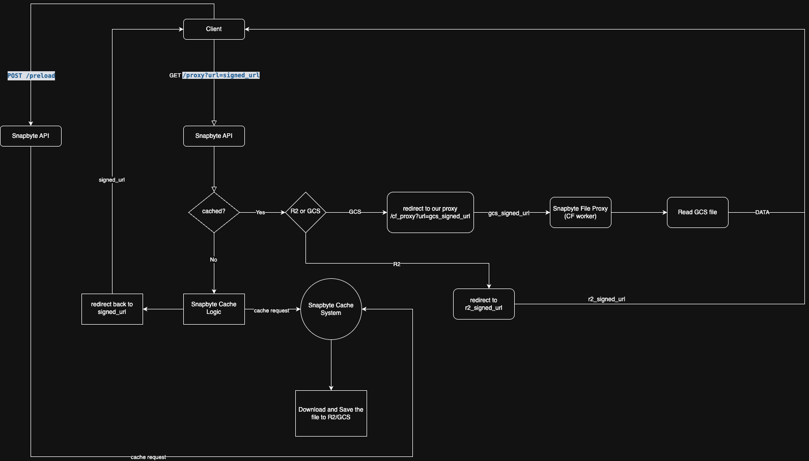

# Cloudflare Worker + R2/GCS Architecture

## Mục tiêu

Hệ thống cho phép khách hàng tối ưu hóa chi phí băng thông bằng cách cache dữ liệu từ backend gốc (Google Cloud, Azure, S3...) sang hệ thống sử dụng Cloudflare Worker + R2/GCS. Mục tiêu giảm đến 60-70% chi phí băng thông cho khách hàng.

---

## Tổng quan 3 mô hình triển khai

### ✅ Mô hình 1: Giao diện tương thích hoàn toàn với storage gốc

**Mô tả:**

* Hệ thống mô phỏng giao diện API tương tự Google Cloud Storage, S3, Azure Blob...
* Khách hàng chỉ cần thay đổi endpoint là có thể tiếp tục dùng các SDK, tool, hoặc chương trình hiện tại mà không cần thay đổi code.

**Ưu điểm:**

* Trải nghiệm khách hàng liền mạch.
* Dễ tích hợp với các hệ thống tự động.

**Nhược điểm:**

* Cực kỳ tốn kém chi phí triển khai do phải mô phỏng đầy đủ:

  * Authentication (OAuth, HMAC)
  * ACL và bucket policy
  * Upload, resumable upload, delete, versioning
  * Streaming APIs

**Phù hợp khi:**

* Khách hàng lớn có nhu cầu cao về tích hợp tự động
* Sẵn sàng trả tiền cho giải pháp full-compatible

---

### ✅ Mô hình 2: Có quyền đọc, cung cấp khách hàng API riêng để truy xuất file

**Mô tả:**

* Khách hàng cấp quyền `read-only` vào bucket gốc (ví dụ GCS, S3)
* Tạo hệ thống API riêng phục vụ nội dung từ backend gốc, đồng thời caching lại vào R2

**Ưu điểm:**

* Chủ động preload/cache file
* Hạn chế phụ thuộc vào thời hạn sống của signed URL
* Cung cấp thêm API tương thích một phần (như GET /bucket/file.txt)

**Nhược điểm:**

* Cần khách hàng cấp quyền truy cập cloud backend
* Khách hàng buộc phải bổ sung mã để chuyển công việc đọc dữ liệu từ backage gốc sang hạ tầng của Snapbyte
* Không phù hợp với khách hàng không có kỹ thuật hoặc ngại thay đổi.

**Phù hợp khi:**

* Khách hàng trung bình/cao cấp, muốn giảm tải băng thông nhưng không thay đổi cấu trúc file
* Muốn hỗ trợ tính năng preload, purge cache...

---

### ✅ Mô hình 3: Proxy theo URL, cache động

**Mô tả:**

* Khách hàng chỉ cần gửi URL trực tiếp tới file cần truy xuất (thường là signed URL)
* Worker sẽ lấy file về, cache vào R2, phục vụ từ lần sau

**Ưu điểm:**

* Tích hợp nhanh (không cần quyền truy cập hoặc cấu hình nhiều)
* Không yêu cầu thay đổi kiến trúc backend gốc
* Chi phí triển khai thấp, dễ scale

**Nhược điểm:**

* Không preload được nếu chưa có request
* Link có thời gian sống (signed URL)
* Khó xác định cache key nếu không có ID duy nhất

**Phù hợp khi:**

* Khách hàng không có khả năng cấu hình cloud backend, không có yêu cầu cao ngoại trừ tiết kiệm băng thông.
* Cần thời gian triển khai ngắn

---

## Kết luận: triển khai mô hình 3 mở rộng (3.5+) trước, sau này khi chúng ta có thể triển khai mô hình số 2 sau.

## Pharse 1: API Design

### Private APIs
#### Authentication: API KEY

#### `POST /cache/<file_hash_or_custom_key>`
- Khách hàng gọi API này để cache file vào hệ thống của snapbyte

Request Body:
```json
{
  "url": "https://storage.googleapis.com/bucket/video.mp4",
  "expires_at": "2025-05-21T10:00:00Z"
}
```

#### `GET /cache/<file_hash_or_custom_key>`
- Khách hàng gọi API này để lấy signed_url tới file đã được cache.
- Nếu chưa được cache trả 404

Return Body:
```json
{
  "url": "https://storage.googleapis.com/bucket/video.mp4",
  "expires_at": "2025-05-21T10:00:00Z"
}
```

#### `DELETE /cache/<file_hash_or_custom_key>`

* Purge file đã cache khỏi R2/GCS

### Cách tạo cache key

* Ưu tiên: `file_hash_or_custom_key` do người dùng cung cấp, nên là md5 của file.

### Public APIs
- Các private apis trên yêu cầu 2 bước, kèo với API key thì khách hàng mới có thể tích hợp và sử dụng snapbyte, đối với các khách hàng yếu về công nghệ, cần có một phương án thay thế để có thể sử dụng ngay lập tức.
- Cần có phương thức để xác định danh tính của khách hàng khi gọi API này, có thể là domain ....
#### Authentication: NONE

#### `GET /snap?signed_url=url&hash=<file_hash_or_custom_key>`
- Khách hàng gọi API này để lấy signed_url tới file đã được cache.
- Nếu chưa được cache thì cache file lại.

Return Body:
```json
{
  "url": "https://storage.googleapis.com/bucket/video.mp4",
  "expires_at": "2025-05-21T10:00:00Z"
}
```

---

## Kiến trúc tổng thể

```text
Client --> API --> Cached ? --> YES --> Worker Proxy --> R2/GCS

                            --> No  --> Redirect back to origin_signed_url
                                    --> Tải và cache file này vào R2/GCS
```

** API **
- API handle các request từ khách hàng. Kiểm tra xem file đã được cache hay chưa:
  1. Nếu đã được cache, thì tạo signed_url truy xuất trực tiếp file trên hạ tầng cache R2/GCS sau đó redirect request của client tới signed_url này.
  2. Trong trường hợp file chưa được cache:
     - Redirect request của client về signed_url ban đầu được khách hàng cung cấp. Giúp client tải ngay file mà không cần chờ đợi.
     - Chuyển yêu cầu qua hạ tầng thứ 2, chuyên về việc tải và cache file.

** Cloudflare Worker Proxy **
- Worker đóng vai trò là trung qian giữa client và R2/GCS:
  - Trong trường hợp file được cache trên R2, có thể cân nhắc trả signed_url trực tiếp tới file này.
  - Trong trường hợp file được cache trên GCS, worker đóng vai trò là file proxy.

- Lý do phải có worker proxy: Ẩn đường link gốc tới GCS (link này phải giữ bí mật 100%), tận dụng hạ tầng xịn của CF cùng với cơ chế miến phí băng thông (có thể phục vụ 1PH băng thông chỉ với $40)

---
## Flowchart

---

### System Requirement
0. Database: Postgres
1. API: 
- API, đặc biệt là GET phải có độ trễ cực thấp < 50-70 ms.
- Có trể triển khai đa luồng, đa server. Toàn hệ thống phải xử lý được tải cao, ít nhất 500-1k req/s

2. Caching System.
- TBD

## Pharse 2: Dashboard & Website

* Hệ thống dashboard thống kê usage/cache hit/miss/storage usage/bandwidth, quản lý files, thanh toán.
* Admin dashboard để quản lý hệ thống: người dùng, usage/cache hit/miss/storage usage/bandwidth/system status ...
* Main website để giới thiệu về Snapbyte

---

## Pharse 3: Tìm kiếm khách hàng

* :D

## Pharse 4: Mâng cấp, tối ưu thuật toán cache

* Hệ thống whitelist IP / signed token bảo vệ proxy URL
* Tự động preload theo lịch hoặc API webhook
* Cung cấp tuỳ chọn sử dụng Domain riêng cho khách hàng.
* Nâng cấp thuật toán cache, chỉ cache file có tần suất sử dụng cao, tối ưu chi phí.
